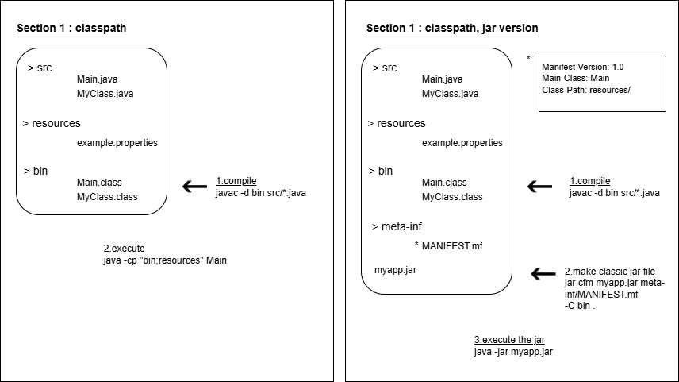

# Report generator application in pure Java

This project was made to review Java modularity without relying on any frameworks, IDEs, or project managers like Maven. In fact, we are using only Notepad++ and the JDK here!

## About 

The main functionality of this application is to generate reports in text and binary files based on multiple pieces of information that the user inputs via the console. The application is available in multiple languages.
In this project, we review several Java concepts, such as concurrency, nio, Stream API, and modularity.

## How to start this project in old-fashioned way ?

In section 1 we use classpath.

In section 2 we use modulepath.

### In Section 1 : classpath

used commands for this project :

1. javac -d bin src/*.java

2. java -cp "bin;resources" Main / java --class-path bin Main

3. jar cfm myapp.jar meta-inf/MANIFEST.mf -C bin .

4. java -jar myapp.jar

### In Section 2 : modularity

For this section, the original code from Section 1 was slightly modified.

used commands for this project :

1. javac --module-source-path src -d out $(find sr
c -name "*.java")

2. jar --create --file mods/com.mygroup.hmi.jar -C out/com.mygroup.hmi . 
3. jar --create --file mods/com.mygroup.ioutil.jar -C out/com.mygroup.ioutil . 
4. jar --create --file mods/com.mygroup.language.jar -C out/com.mygroup.language . -C src/com.mygroup.language/Resource-Bundle . 
5. jar --create --file mods/com.mygroup.main.jar --main-class=com.mygroup.main.Main -C out/com.mygroup.main . 
6. jar --create --file mods/com.mygroup.report.jar -C out/com.mygroup.report . 

7. java --module-path mods -m com.mygroup.main/com.mygroup.main.Main
